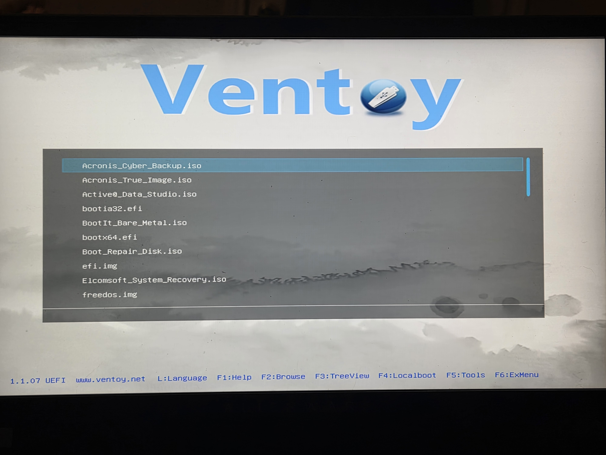
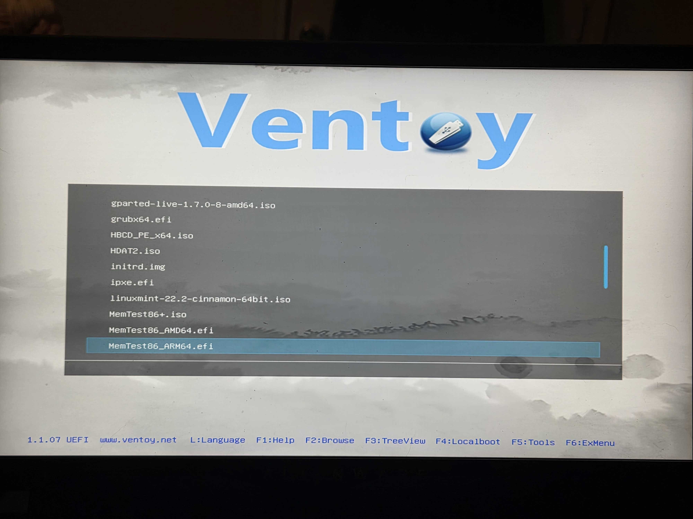
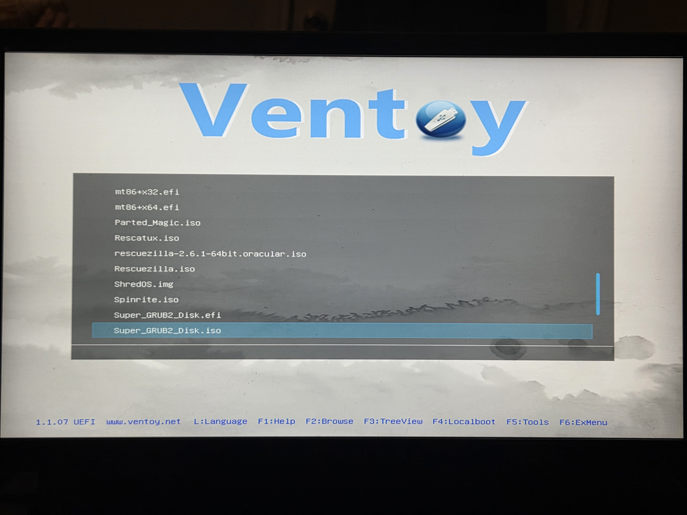
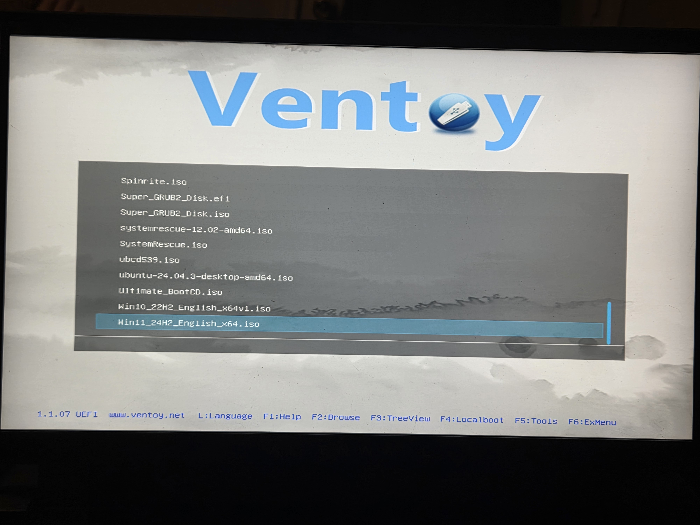

# Creating a Tech Swiss Army Knife

## Project Overview

### Project Goal

&nbsp;&nbsp;&nbsp;&nbsp;To make a single tool that can be used in order to install nearly all commonly used operating systems, as well as a robust toolkit for system repair, data recovery and virus detection and removal.

### Key Skills Demonstrated

&nbsp;&nbsp;&nbsp;&nbsp;* Proficiency in Linux system administration

&nbsp;&nbsp;&nbsp;&nbsp;* Proficiency in cross-platform compatibility using exFAT.

&nbsp;&nbsp;&nbsp;&nbsp;* Ability to create and configure a USB boot loader.

### Project Outcome

&nbsp;&nbsp;&nbsp;&nbsp;* Successfully configured the USB to hold multiple ISOs and tools for repair, recovery, and bench-marking.

&nbsp;&nbsp;&nbsp;&nbsp;* Made a robust multi-tool that includes many repair and recovery tools and multiple OSs.

&nbsp;&nbsp;&nbsp;&nbsp;* Correctly configured my file management system to be able to extract compressed .rar, and .7z files.

## Technologies Used

### Hardware

&nbsp;&nbsp;&nbsp;&nbsp;* Alienware m15 r3 laptop.

&nbsp;&nbsp;&nbsp;&nbsp;* Unencrypted SanDisk Ultra USB 3.0 64GB.

### Software

&nbsp;&nbsp;&nbsp;&nbsp;* **General Software:**

&nbsp;&nbsp;&nbsp;&nbsp;&nbsp;&nbsp;&nbsp;&nbsp;* Ubuntu 24.04.3 LTS - My home OS.

&nbsp;&nbsp;&nbsp;&nbsp;&nbsp;&nbsp;&nbsp;&nbsp;* Ventoy software - Makes it possible to have multiple ISOs and recovery tools.

&nbsp;&nbsp;&nbsp;&nbsp;* **ISOs:**

&nbsp;&nbsp;&nbsp;&nbsp;&nbsp;&nbsp;&nbsp;&nbsp;* Windows 10 - Windows OS.

&nbsp;&nbsp;&nbsp;&nbsp;&nbsp;&nbsp;&nbsp;&nbsp;* Windows 11 - Windows OS.

&nbsp;&nbsp;&nbsp;&nbsp;&nbsp;&nbsp;&nbsp;&nbsp;* Ubuntu 24.04.3 LTS - Linux OS.

&nbsp;&nbsp;&nbsp;&nbsp;&nbsp;&nbsp;&nbsp;&nbsp;* Linux Mint Cinnamon - Linux OS.

&nbsp;&nbsp;&nbsp;&nbsp;* **Recovery Tools:**

&nbsp;&nbsp;&nbsp;&nbsp;&nbsp;&nbsp;&nbsp;&nbsp;* Rescuezilla - Used for disk imaging and cloning.

&nbsp;&nbsp;&nbsp;&nbsp;&nbsp;&nbsp;&nbsp;&nbsp;* SystemRescue - Used for Linux based system repair, recovering data, and fixing data partitions.

&nbsp;&nbsp;&nbsp;&nbsp;&nbsp;&nbsp;&nbsp;&nbsp;* Hiren's Boot CD - Used for Windows OS repair, recovering data, partitioning drives, and removing malware.

&nbsp;&nbsp;&nbsp;&nbsp;&nbsp;&nbsp;&nbsp;&nbsp;* GParted - Used for Linux with advanced partition management and disk formatting.

&nbsp;&nbsp;&nbsp;&nbsp;&nbsp;&nbsp;&nbsp;&nbsp;* Clonezilla - Powerful command-line desk imaging and cloning utility for backups, deployment, and recovery.

&nbsp;&nbsp;&nbsp;&nbsp;&nbsp;&nbsp;&nbsp;&nbsp;* Ultimate Boot CD (UBCD) - A boot-able toolkit used for diagnosing hardware, repairing systems, recovering and cloning data, bench marking performance, and running legacy DOS utilities.

&nbsp;&nbsp;&nbsp;&nbsp;&nbsp;&nbsp;&nbsp;&nbsp;* MediCat - Windows based toolkit with system repair, malware removal, data recovery, data partitioning, password resetting, and portable diagnostic tools.

### Tools

&nbsp;&nbsp;&nbsp;&nbsp;* Linux Terminal.

&nbsp;&nbsp;&nbsp;&nbsp;* Ubuntu disks application.

&nbsp;&nbsp;&nbsp;&nbsp;* File Manager and installed file manager function.

&nbsp;&nbsp;&nbsp;&nbsp;* Linux App Center 

## Configuration Snippets

### Linux Terminal Commands

<table style="width:100%;">
    <tr>
        <td style="width:50%;">
            sudo apt install exfat-fuse exfatprogs
        </td>
        <td style="width:50%;">
            Allows formatting disks to exFAT on Linux
        </td>
    </tr>
    <tr>
        <td style="width:50%;">
            cd Downloads
        </td>
        <td style="width:50%;">
            Navigates to the "Downloads" folder on my home drive
        </td>
    </tr>
    <tr>
        <td style="width:50%;">
            ls
        </td>
        <td style="width:50%;">
            List files and directories
        </td>
    </tr>
    <tr>
        <td style="width:50%;">
            tar -xvf ventoy-1.1.07-linux.tar.gz
        </td>
        <td style="width:50%;">
            Extracts the files from the compressed Ventoy download archive.
        </td>
    </tr>
    <tr>
        <td style="width:50%;">
            cd ventoy-1.1.07
        </td>
        <td style="width:50%;">
            Navigates to the Ventoy version folder.
        </td>
    </tr>
    <tr>
        <td style="width:50%;">
            sudo ./Ventoy2Disk.sh -i /dev/sdx
        </td>
        <td style="width:50%;">
            Installs Ventoy onto my USB and configures it for ISO copying.
        </td>
    </tr>
    <tr>
        <td style="width:50%;">
            sudo apt install qbittorrent
        </td>
        <td style="width:50%;">
            Installs the qbittorrent application for Linux.
        </td>
    </tr>
    <tr>
        <td style="width:50%;">
            lsblk
        </td>
        <td style="width:50%;">
            Used to view block storage on drives.
        </td>
    </tr>
    <tr>
        <td style="width:50%;">
            sudo apt update
        </td>
        <td style="width:50%;">
            Updates the package list.
        </td>
    </tr>
    <tr>
        <td style="width:50%;">
            7z --version
        </td>
        <td style="width:50%;">
            Verifies if the 7z package list install.
        </td>
    </tr>
    <tr>
        <td style="width:50%;">
            sudo apt install file-roller unrar p7zip-full p7zip-rar
        </td>
        <td style="width:50%;">
            Adds GUI support to the files manager for extracting files.
        </td>
    </tr>
</table>

## URLs

### Operating System ISOs

&nbsp;&nbsp;&nbsp;&nbsp;* [Ventoy download](https://www.ventoy.net/en/download.html)

&nbsp;&nbsp;&nbsp;&nbsp;* [Windows 10 download](https://www.microsoft.com/en-us/software-download/windows10ISO)

&nbsp;&nbsp;&nbsp;&nbsp;* [Windows 11 download](https://www.microsoft.com/en-us/software-download/windows11)

&nbsp;&nbsp;&nbsp;&nbsp;* [Ubuntu 24.04.3 LTS download](https://ubuntu.com/download/desktop)

&nbsp;&nbsp;&nbsp;&nbsp;* [Linux Mint Cinnamon download](https://linuxmint.com/edition.php?id=322)

### Rescue/Recovery Tools

&nbsp;&nbsp;&nbsp;&nbsp;* [RescueZilla backup/recovery tool download](https://rescuezilla.com/download)

&nbsp;&nbsp;&nbsp;&nbsp;* [SystemRescue rescue/recovery tool download](https://sourceforge.net/projects/systemrescuecd/)

&nbsp;&nbsp;&nbsp;&nbsp;* [Hiren's Boot CD download](https://www.hirensbootcd.org/download/)

&nbsp;&nbsp;&nbsp;&nbsp;* [GParted rescue/recovery tool download](https://sourceforge.net/projects/gparted/)

&nbsp;&nbsp;&nbsp;&nbsp;* [Clonezilla resuce/recovery tool download](https://sourceforge.net/projects/clonezilla/)

&nbsp;&nbsp;&nbsp;&nbsp;* [Ultimate Boot CD rescue/recovery tool download](https://www.ultimatebootcd.com/download.html)

&nbsp;&nbsp;&nbsp;&nbsp;* [Opera web browser installtion download](https://www.opera.com/opera)

&nbsp;&nbsp;&nbsp;&nbsp;* [MediCat download](https://medicatusb.com/#google_vignette)

## Step-by-Step Walk-through

### Setting Up File Extraction

1. Update package list

```
    bash

    sudo apt update
```

2. Installed the package to add system and GUI support for extracting files.

```
    bash

    sudo apt install file-roller unrar p7zip-full p7zip-rar
```

3. Re-updated package list

```
    bash

    sudo apt update
```

### Ventoy Installation

1. Formatted the flash drive

&nbsp;&nbsp;&nbsp;&nbsp;&nbsp;&nbsp;&nbsp;&nbsp;* Deleted excess partitions.

&nbsp;&nbsp;&nbsp;&nbsp;&nbsp;&nbsp;&nbsp;&nbsp;* Formatted the flash drive to exFAT for general compatibility.

2. Configured flash drive with Ventoy
&nbsp;&nbsp;&nbsp;&nbsp;&nbsp;&nbsp;&nbsp;&nbsp;

&nbsp;&nbsp;&nbsp;&nbsp;&nbsp;&nbsp;&nbsp;&nbsp;* Navigated to "downloads" folder on the home drive.

```
    bash

    cd Downloads
```


&nbsp;&nbsp;&nbsp;&nbsp;&nbsp;&nbsp;&nbsp;&nbsp;* Extracted the file directory from the Ventoy tar archive file.

```
    bash

    tar -xvf ventoy-1.1.07-linux.tar.gz
```

&nbsp;&nbsp;&nbsp;&nbsp;&nbsp;&nbsp;&nbsp;&nbsp;* Navigated to the extracted folder and executed the `.sh` file to the correct block device.

```
    bash

    lsblk
    cd Ventoy-1.1.07
    sudo ./Ventoy2Disk.sh -i /dev/sdx
```

&nbsp;&nbsp;&nbsp;&nbsp;**Note: Cannot use conventional file extraction methods, because bootloader and disk partitioning processes would by bypassed.**

### Desktop OS Installations

&nbsp;&nbsp;&nbsp;&nbsp;Downloaded the [Windows 10 ISO](https://www.microsoft.com/en-us/software-download/windows10ISO), [Windows 11 ISO](https://www.microsoft.com/en-us/software-download/windows11), [Ubuntu 24.04.3 LTS ISO](https://ubuntu.com/download/desktop), and a mirror of the  [Linux Mint Cinnamon ISO](https://linuxmint.com/edition.php?id=322) to the internal hard drive and copied them over to the Ventoy drive.

### Rescue/Recovery Tools

&nbsp;&nbsp;&nbsp;&nbsp;* Downloaded the [RescueZilla](https://rescuezilla.com/download) tool for disk imaging and cloning, and copied it to the Ventoy drive.

&nbsp;&nbsp;&nbsp;&nbsp;* Downloaded the [SystemRescue](https://sourceforge.net/projects/systemrescuecd/) tool, for Linux based system repair, and copied it to the Ventoy drive.

&nbsp;&nbsp;&nbsp;&nbsp;* Downloaded the [Hiren's Boot CD](https://www.hirensbootcd.org/download/) tool, for Windows OS repair, and copied it to the Ventoy drive. This is found near the bottom of the page in the file info table.

&nbsp;&nbsp;&nbsp;&nbsp;* Downloaded the [GParted](https://sourceforge.net/projects/gparted/) tool, for a fallback if RescueZilla doesn't work, and copied it to the Ventoy drive.

&nbsp;&nbsp;&nbsp;&nbsp;* Downloaded the [Clonezilla](https://sourceforge.net/projects/clonezilla/) tool, a lot more robust option to RescueZilla. Extracted the contents from the compressed file archive and copied the contents over to the Ventoy drive.

&nbsp;&nbsp;&nbsp;&nbsp;* Downloaded the [Ultimate Boot CD](https://www.ultimatebootcd.com/download.html) (UBCD) tool, which is a robust tool for repairing, recovery, diagnostics, and bench-marking, with DOS utility capability. This cam in the version of a torrent file, which has compatibility issues with Firefox, so switching to a web browser like Opera for compatibility is recommended.

&nbsp;&nbsp;&nbsp;&nbsp;&nbsp;&nbsp;&nbsp;&nbsp;a. Downloaded the Opera web browser from the App Center.

&nbsp;&nbsp;&nbsp;&nbsp;&nbsp;&nbsp;&nbsp;&nbsp;b. Downloaded "QBittorrent" from the App Center and clicked on the link for the ISO under P2P on the UBCD download page.

&nbsp;&nbsp;&nbsp;&nbsp;&nbsp;&nbsp;&nbsp;&nbsp;c. Used the QBittorent file manager to download the ISO and copied it to the Ventoy drive.

&nbsp;&nbsp;&nbsp;&nbsp;* Downloaded [MediCat](https://medicatusb.com/#google_vignette) tool, which is a massive Windows rescue kit, used for system repair, malware removal, data recovery, disk partitioning, password resetting, and running diagnostics in a Windows envirnment. MediCat is a .7x file so file extraction is required.

&nbsp;&nbsp;&nbsp;&nbsp;&nbsp;&nbsp;&nbsp;&nbsp;a. Downloaded the first mirror file for MediCat under direct download mirrors.

&nbsp;&nbsp;&nbsp;&nbsp;&nbsp;&nbsp;&nbsp;&nbsp;b. Used the file manager to create a folder in the Ventoy drive to extract the MediCat package to and extracted the compressed folder to it.

## Problem & Solution

**Problem:** Linux does not native support exFAT file systems and need to make sure the flash drive is formatted properly.

**Solution:** Needed to figure out how to give Ubuntu the function to read, write, and format exFAT file systems.

1. Installed exFAT support using the Linux terminal.

```
    bash

    sudo apt install exfat-fuse exfatprogs
```

2. Tested changes by using the built in Linux Disks application for managing and configuring hard drives to format the flash drive to exFAT for best functionality. 

## Verification & Testing









## Lessons Learned/Best Practices

&nbsp;&nbsp;&nbsp;&nbsp;* Use exFAT for maximum compatibility across Windows and Linux when building multi-boot drives.

&nbsp;&nbsp;&nbsp;&nbsp;* Keep one or two lightweight recovery ISOs (like GParted) for quick fixes instead of relying on heavy ones like MediCat.